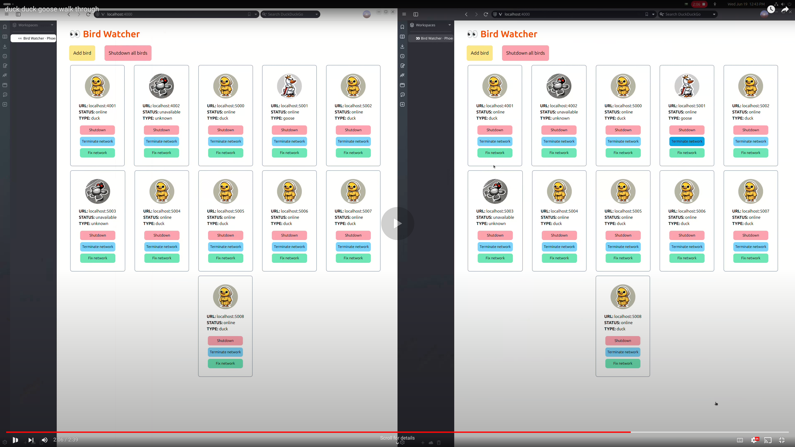

# duck-duck-goose

A duck duck goose game simulation used to represent the node leader election process. The entire code base is written in Elixir. Some files to highlight:

* [`Dockerfile`](Dockerfile): Docker configuration to easily get the applications up and running
* [`/birds/lib/birds/router.ex`](/birds/lib/birds/router.ex): Endpoints for the bird node server
* [`/birds/lib/birds/bird.ex`](/birds/lib/birds/bird.ex): Bird node GenServer
* [`/birds/lib/birds/db/`](/birds/lib/birds/db/): Folder with the DB behavior (interface), DB wrapper, and test DB
* [`/birds/test/birds_test.exs`](/birds/test/birds_test.exs): Main end-to-end test file for the bird nodes
* [`/bird_watcher/lib/bird_watcher_web/router.ex`](/bird_watcher/lib/bird_watcher_web/router.ex): API endpoints for the simple db
* [`/bird_watcher/lib/bird_watcher_web/live/bird_watcher_live.ex`](/bird_watcher/lib/bird_watcher_web/live/bird_watcher_live.ex): Live view component for the web app
* [`/bird_watcher/lib/bird_watcher/db.ex`](/bird_watcher/lib/bird_watcher/db.ex): Simple DB functionality, essentially a document store
* [`/bird_watcher/lib/bird_watcher/watcher.ex`](/bird_watcher/lib/bird_watcher/watcher.ex): GenServer that continuously polls the bird nodes to get their updated statuses for the web app

## Video walkthrough

Click below to watch the video walkthrough on youtube. For some reason, my screen recorder didn't pick up the mouse properly, so some parts seem confusing. However, it should be enough to get the overall picture.

## How to run the servers

### Docker (easiest)

1. Install docker on your machine.
2. Navigate to the main folder: `cd duck-duck-goose`. You should see a Dockerfile.
3. Build the docker image: `docker build -t duck-duck-goose .`.
4. Run the docker image: `docker run --network="host" --name=ducky duck-duck-goose`.
Note: that we're just running the dev version of the applications locally, so exposing all network ports is fine.
5. Open the phoenix application on a browser to easily view bird nodes: `localhost:4000`.
8. Create bird nodes either by clicking the "Add bird" button or manually: `docker exec -it ducky sh -c "cd /app/birds && PORT=4001 mix run --no-halt"`.
Note: that you'll have to manually manage the ports to avoid reusing them.

### Manually

1. Install elixir 1.17.1 and mix.
2. Navigate to the bird_watcher application: `cd duck-duck-goose/bird_watcher`.
3. Fetch dependencies and compile: `mix do deps.get, deps.compile, compile`.
4. Start the phoenix application: `mix phx.server`.
5. Open the phoenix application on a browser to easily view bird nodes: `localhost:4000`.
6. Navigate to the birds application: `cd ../birds`.
7. Fetch dependencies and compile: `mix do deps.get, deps.compile, compile`.
8. Create bird nodes either by clicking the "Add bird" button or manually: `PORT=4001 mix run --no-halt`.
Note: that you'll have to manually manage the ports to avoid reusing them.

## How to run tests

The birds application has basic tests in the `/birds/tests/birds_test.exs` file.

1. Navigate to the birds application: `cd birds`.
2. Run tests: `mix test`

## High level approach

The birds application is used to represent a node (aka a bird), and the bird_watcher application is mainly used to provide a web interface to interact with the nodes.
Bird_watcher also serves as a simple document datastore used for coordination by the nodes (birds). While I was able to build out the overall experience that I envisioned,
I'm currently using a naive consensus algorithm.

The leader election process is using a specific key in the datastore to coordinate the leader. The key is essentially being used like a lock. If the "goose" key is empty,
you can set yourself to be the leader with a 5s ttl. If you're already set as the leader, you can update the ttl. Every second, all of the nodes try to either become the leader
or update the ttl of their leadership. If the leader shutsdown or gets a network parition, then a new node can become the leader by setting itself on the "goose" key, once it expires.

## Node endpoints

The bird node server has the following four endpoints:

* GET `/status`: returns the status of the node
* POST `/shutdown`: shuts down the node and halts the server
* POST `/terminate_network`: simulates a network partition
* POST `/fix_network`: fixes the simulated network partition
